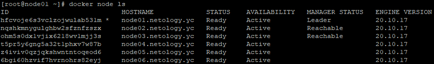
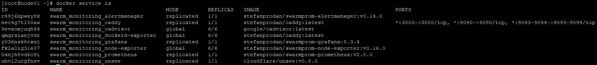

# Домашнее задание к занятию "5.5. Оркестрация кластером Docker контейнеров на примере Docker Swarm"
1. Ответы на вопросы:  
   * replication создаёт заданное количество контейнеров, а global создаёт по одному контейнеру на каждом узле.
   * Для выбора лидера используется алгоритм raft. Если действующий лидер стал недоступен управляющие узлы переходят в состояние кондидата, все узлы учавствуют в голосовании и кандидат с большим кол-вом голосов становится лидером.
   * overlay network - внутренная сеть кластера docker swarm которая соеденяет между собой сети различных узлов кластера.
2. Вывод команды docker node ls:  
   
3. Вывод команды docker service ls:  
   
4. Насколько я понял из документации. Docker swarm шифрует логи raft и трафик между нодами и когда docker перезапускается он автоматически загружает эту информацию. Команда ```docker swarm update --autolock=true``` позволяет блокировать функцию загрузки при запуске/перезапуске docker и в этом случае, для загрузки docker, будет необходимо разблокировать docker при помощи команды ```docker swarm unlock``` и ключа предоставленного во время выполнения команды ```docker swarm update --autolock=true```